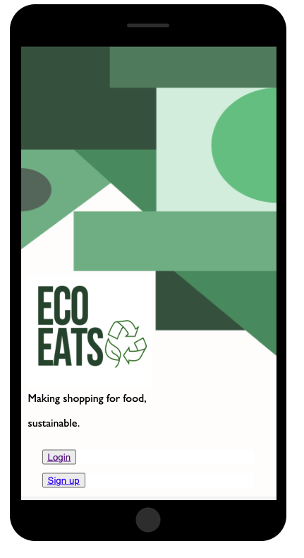
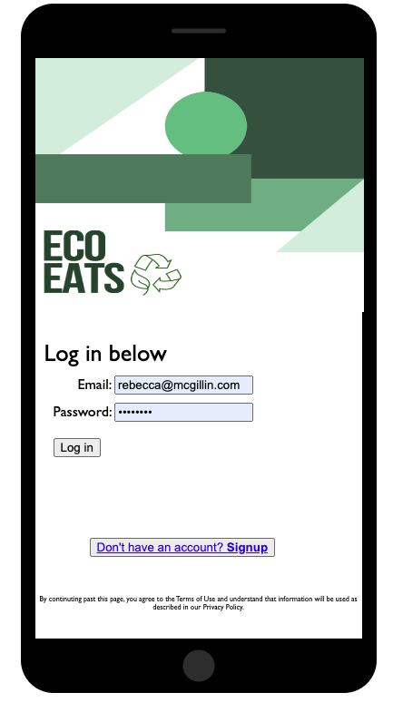
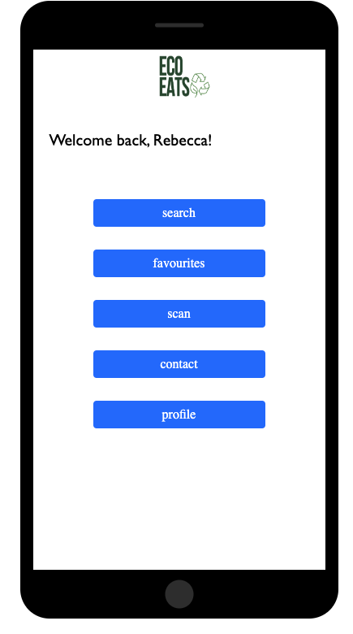
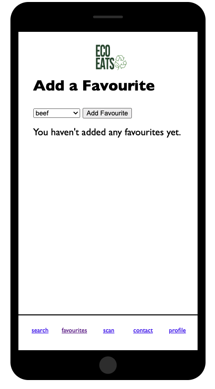
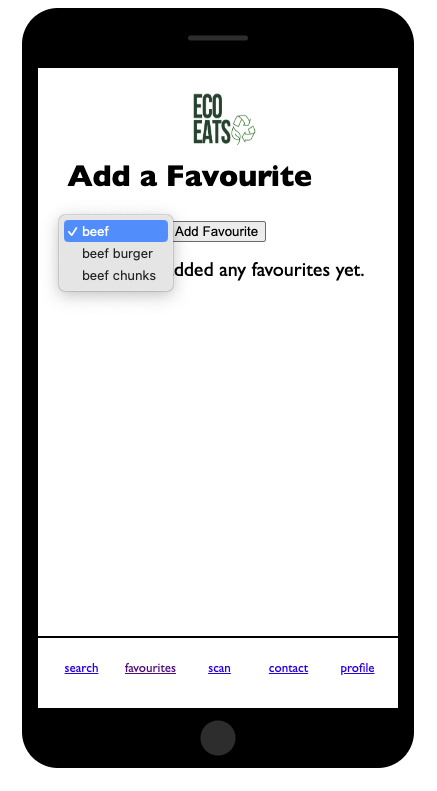

# ecoeats
## Rebecca McGillin
###Thesis Project for QUB BIT 2023

This project included a large design effort to crystalise an application which allowed you to identify products which would be able to be used. 

You can take a look at the project original design here

[Figma Design for EcoEats](https://www.figma.com/file/NFFhiLSTrA3PqaXMH0hIhO/BIT-Project?node-id=58-72)

Now, we have created a small demo of some of the functionality which utilises the design from figma. 

These main screens below show the initial walkthrough of the screens in this repository.

The repository jas an application built with Python over a flask framwework and a SQLite3 databases to support the information to demonstrate the concepts.

